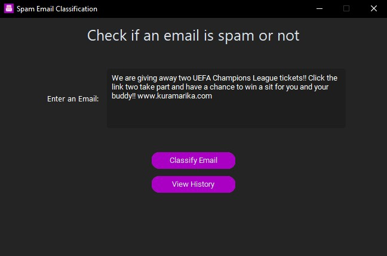
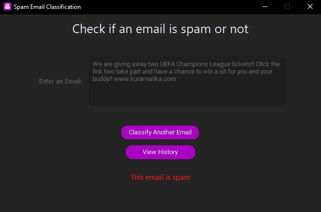
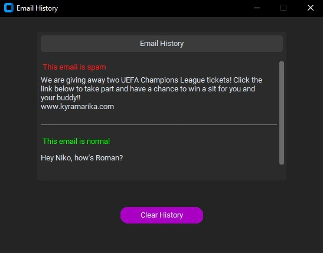
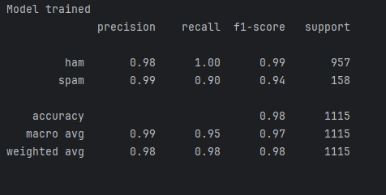

# GLabris-Spam_Email_Classifier
A simple project that uses a SVM model to detect spam emails based on their content

## 📌 Project Overview

This Machine Learning project is a simple **Spam Email Classifier** that uses a **Support Vector Machine (SVM)** model to classify emails as either "spam" or "ham". The model is trained on a dataset of labeled emails. Before the model is trained, the emails go through 
a preproccesing stage where the data is stemmed and the stopwords are removed. Then the clean data is vectorized by a **TfidfVectorizer** to process the textual data. 

## 🖼️ App Preview

Here is how the app looks:

---

### 🔹 Step 1: Enter the email you want to check

---

### 🔹 Step 2: Click the "Classify Email" button

---

### 🔹 Optional Step: Check your email history or even clear it

## 📊 The Dataset

The dataset that was used for the training of the model is a Kaggle dataset made by Ashfak Yeafi under the Apache 2.0 licesne.

- Dataset source: [Spam email classification](https://www.kaggle.com/datasets/ashfakyeafi/spam-email-classification)

## 📈 Model Performance

---

### 🔹 Model Accuracy, Precision, Recall and F1-scores

## ⚙️ Requirements and usability

In order to use this tool you need:
- Python 3.7+ is recommended
- The following libraries: scikit-learn, pandas, numpy, nltk
- Train the model by running the 'spam_classification.py' file in your system

**WARNING**: Firstly run the "spam_classification.py" then test the model out.

If you run into a "Can't find a usable init.tcl" bug,
you have to  to copy two folders from tcl folder to the Lib folder tcl8.5 and tk8.5(version may be different).

- [Bug Fix](https://stackoverflow.com/questions/29320039/trying-to-use-tkinter-throws-tcl-error-cant-find-a-usable-init-tcl)

## 🎯 The goal of this project

I started this project to get myself familiar with building a Machine Learning model and the all around stuff(preprocessing the data, stemming, vectorizing)
and learn the basics of python GUI even though i don't know how usefull it's going to be for me. 
I will probably not work on this project anymore, instead i plan on making something useful.

